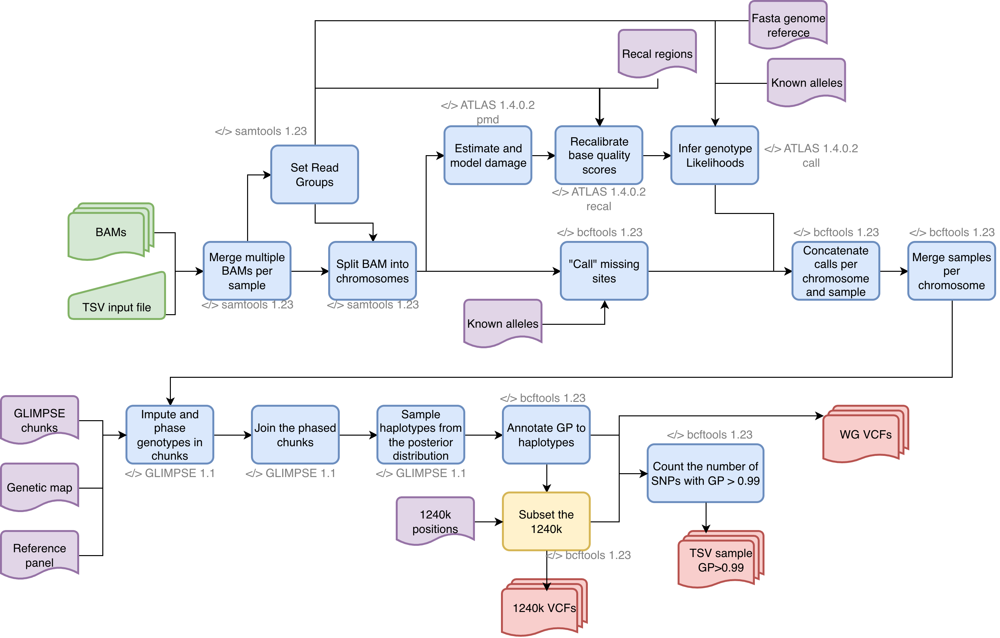

# call_impute

Nextflow pipeline (DSL2) that runs ATLAS to infer genotype likelihoods and the run GLIMPSE to impute ancient genomes. 

---

### Workflow overview
 

---


### Features
  **-v 0.1.0**

* Supports bams as input.
* Option to run glimpse or not and only get ATLAS output.
* Option to get only the 1240k
* Scalability and reproducibility via a Nextflow-based framework.
* Compatible with nf-core institutional configs.

---

## Requirements
#### Compatible OS*:
* [Ubuntu 24.04.4 LTS](https://releases.ubuntu.com/focal/)
* macOS

#### Software:
|                            Requirement                            | Version  |              Required Commands *               |
| :---------------------------------------------------------------: | :------: | :--------------------------------------------: |
|         [bcftools](https://samtools.github.io/bcftools/)          |   1.23   | reheader,view,index,merge,annotate,call,concat |
|          [samools](https://samtools.github.io/samtools/)          |   1.23   |                   view,merge                   |
|  [nextflow](https://www.nextflow.io/docs/latest/getstarted.html)  | 26.04.3  |                    nextflow                    |
| [GLIMPSE](https://odelaneau.github.io/GLIMPSE/docs/documentation) |   1.1    |               chunk,ligate,phase               |
|              [atlas](https://atlaswiki.netlify.app/)              | v1.4.0.2 |                 call,pmd,recal                 |

\* These commands must be accessible from your `$PATH` (*i.e.* you should be able to invoke them from your command line).  

---

### Installation
Download nf-haplotype-selection from Github repository:  
```
git clone https://github.com/jbv2/call_impute.git
```
---

#### Test
To test `call_impute` execution using test data, run:
```bash
nextflow run main.nf -profile <test>
```

This pipeline can use nf-core Institutional profiles.
For MPI EVA people, please use the following to test on GRACE:

```bash
module load apptainer/1.5.0 ## to be able to run Nextflow
module load java/1.21.0 ## to use java for nextflow
module load bcftools/1.23.1
module load samtools/1.23.1
module load bcftools/1.23.1
module load htslib/1.23.1
module load GLIMPSE/1.1.1-static
which atlas ##verify you have atlas in your $PATH

nextflow run main.nf -profile eva_grace,test
```

---

### Usage 
To run `call_impute` go to the pipeline directory and execute:

```bash
nextflow run main.nf \
  -c call_impute.config \ ## Config with the specified paths for the references
  --input 'test/data/input.tsv' \ ## Input tsv 
  --outdir 'test/results' \ ## Output directory
  --project_name 'test' \ ## general name
  --get_1240k <true/false> \ ## specify if you want to subset to the 1240k. Defaulf: false
  --csv_1240k 'test/reference/1240kSNPs/' ## Path to the directory with the 1240k csvs per chromosome

```
 
Where your config file has these options:

```java
profiles {
  hs37d5_1KGP {
      params {
      config_profile_name        = 'hs37d5_1KGP'
      config_profile_description = 'Imputation of low-coverage ancient genomes'

      // References
      fasta = "<PATH to the fasta reference genome>"
      fai = "<PATH to the fasta index>"

      // ATLAS parameters
      atlas_pmd_length = 50 
      atlas_recal_regions = "<PATH to the `.bed` file for atlas to run recal" 
      atlas_recal_chr = 20 ## Chromosome that ATLAS uses to run recal
      method = 'MLE' ## Method for genotyping
      alleles = "<PATH to the `alleles` file for Atlas to infer genotypes likelihoods>" 

      // bcftools call parameters
      bcftools_alleles = "<PATH to the `alleles` file for bcftools to infer genotypes>"
      ref_snps_only = "<PATH to `vcf.gz` with its index (`vcf.gz.tbi`) for bcftools to infer genotypes>"

      // GLIMPSE references
      run_glimpse = true 
      glimpse_ref = "<PATH to the`GLIMPSE` reference panel directory.>" 
      glimpse_map = "<PATH to the`GLIMPSE` genetic map directory directory.>"  
      glimpse_chunks = "<PATH to the`GLIMPSE` chunks.>"
      
  }

  }

  
}
```
---

### Pipeline inputs 

1. `input.tsv`
   * A `TSV` file with three columns: `sample bam bai`.
    Example line(s):
    ```bash
    sample	bam	bai
    PC537	test/data/PC537_chr20_1.0x.bam	test/data/PC537_chr20_1.0x.bam.bai
    PC537	test/data/PC537_chr21_1.0x.bam	test/data/PC537_chr21_1.0x.bam.bai
    PC537	test/data/PC537_chr22_1.0x.bam	test/data/PC537_chr22_1.0x.bam.bai
    ```

    1A. The `.bam` files you want to input, together with their `.bai`.

2. A `.fasta` file with its index (`.fai`) of the reference genome you used to aligne your BAMS. 
3. A `.bed` file for atlas to run recal. 
    Example line(s):
    ```bash
    20      5556502 5556504
    20      5556505 5556507
    20      5556508 5556510
    20      5556512 5556513
    ```
4. An `alleles` file for Atlas to infer genotypes likelihoods. 
    Example line(s):
    ```bash
    20      60479   C       T
    20      60571   C       A
    20      60828   T       G
    20      61098   C       T
    ```
5. An `alleles` file for bcftools to infer genotypes. 
    Example line(s):
    ```bash
    20      60479   C,T
    20      60571   C,A
    20      60828   T,G
    20      61098   C,T
    ```
6. A `vcf.gz` with its index (`vcf.gz.tbi`) for bcftools to infer genotypes. 
For more information about the VCF format, please go to the next link: [Variant Call Format](https://www.internationalgenome.org/wiki/Analysis/Variant%20Call%20Format/vcf-variant-call-format-version-40/)
    Example line(s):
    ```bash
    ##fileformat=VCFv4.2
    #CHROM  POS     ID      REF     ALT     QUAL    FILTER  INFO
    20      60479   rs149529999     C       T       .       PASS    AN=5008;AF=0.00339457;AC=17
    20      60571   rs116145529     C       A       .       PASS    AN=5008;AF=0.00199681;AC=10
    20      60828   rs187713677     T       G       .       PASS    AN=5008;AF=0.00119808;AC=6
    20      61098   rs6078030       C       T       .       PASS    AN=5008;AF=0.287141;AC=1438
    ```
7. A `GLIMPSE` reference panel directory that contains:
  * A `VCF` with its index (`.vcf.gz.tbi`) with snps per chromosome. Usually the 1KGP reference panel is used.
    Example line(s):
      ```bash
      ##fileformat=VCFv4.2
      #CHROM  POS     ID      REF     ALT     QUAL    FILTER  INFO    FORMAT  HG00096 HG00097 HG00099 HG00100 HG00101 HG00102 HG00103 HG00105 HG00106 HG00107 HG00108 HG00109 HG00110 HG00111 HG00112 HG00113 HG00114 HG00115 HG00116 HG00117 HG00118 HG00119 HG00120 HG001>
      20      60479   rs149529999     C       T       .       PASS    AN=5008;AF=0.00339457;AC=17     GT      0|0     0|0     0|0     0|0     0|0     0|0     0|0     0|0     0|0     0|0     0|0     0|0     0|0     0|0     0|0     0|0     0|0     0|0     0|0     0|0  >
      20      60571   rs116145529     C       A       .       PASS    AN=5008;AF=0.00199681;AC=10     GT      0|0     0|0     0|0     0|0     0|0     0|0     0|0     0|0     0|0     0|0     0|0     0|0     0|0     0|0     0|0     0|0     0|0     0|0     0|0     0|0  >
      20      60828   rs187713677     T       G       .       PASS    AN=5008;AF=0.00119808;AC=6      GT      0|0     0|1     0|0     0|0     0|0     0|0     0|0     0|0     0|0     0|0     0|0     0|0     0|0     0|0     0|0     0|0     0|0     0|0     0|0     0|0  >
      20      61098   rs6078030       C       T       .       PASS    AN=5008;AF=0.287141;AC=1438     GT      0|0     0|0     0|0     0|0     0|1     0|0     1|0     0|0     0|0     0|0     0|0     0|1     0|0     0|1     0|0     0|0     0|0     1|0     0|0     1|0  >
      ```
8. A `GLIMPSE` genetic map directory that contains:
  * A `.gmap.gz` per chromosome from the version of the genome you are using. 
    Example line(s):
    ```bash
    pos     chr     cM
    61795   20      0.000000
    63231   20      0.001056
    63244   20      0.001066
    63799   20      0.001473
    ```
9. A `GLIMPSE` chunks directory that contains:    
Output from running GLIMPSE_chunk on the reference panel you are using. Better to only run it once. 
  * A `.txt` per chromosome.
    Example line(s):
    ```bash
    0       20      20:60479-3867430        20:60479-3667395        3606917 41914
    1       20      20:3467342-7285687      20:3667406-7085233      3417828 41913
    2       20      20:6885259-11156251     20:7085271-10955878     3870608 41914
    3       20      20:10755798-15077388    20:10955980-14877295    3921316 41912
    ```
10. If `--get_1240k true`, `--csv_1240k` needs a path to the directory with the 1240k csvs per chromosome.
  * A `.csv` per chromosome with the 1240k positions. 
  Example line(s):
      ```bash
      20      63244
      20      63799
      20      68749
      20      69094
      20      74347
      ```

---

### Pipeline Results

* A compressed imputed `VCF` with its index `.vcf.gz.csi` per chromosome.
  Example line(s):
    ```bash
    ##fileformat=VCFv4.2
    #CHROM  POS     ID      REF     ALT     QUAL    FILTER  INFO    FORMAT  PC537
    20      63244   rs6139074       A       C       .       .       RAF=0.218251;AF=0.0025;INFO=0.003;AC=0;AN=2     GT:GP:DS        0|0:0.995,0.005,0:0.005
    20      63799   rs1418258       C       T       .       .       RAF=0.439497;AF=0.003;INFO=0.003;AC=0;AN=2      GT:GP:DS        0|0:0.994,0.006,0:0.006
    20      68749   rs6086616       T       C       .       .       RAF=0.571286;AF=0.926;INFO=0;AC=2;AN=2  GT:GP:DS        1|1:0.006,0.136,0.858:1.852
    ```

* A  `imputation_qc.tsv` file with the number of sites that have GP_0.99 per individual.
  Example line(s):
    ```bash
    sample  n_sites_GP_0.99
    PC537   1017889
    ```

* For the 1240k subset
Results will be in the directory:

  ```bash
  <outputdir>/vcfs_1240k 
  ```

* For the whole-genome 
Results will be in the directory:

  ```bash
  <outputdir>/vcfs_wg
  ```

---

#### References
Under the hood `call_impute` uses some coding tools, please include the following ciations in your work:

* Wegmann, D., Sell, C., Kousathanas, A., & Veeramah, K. R. (2017). ATLAS: Analysis Tools for Low-depth and Ancient Samples.
* Rubinacci, S., Ribeiro, D. M., Hofmeister, R. J., & Delaneau, O. (2021). Efficient phasing and imputation of low-coverage sequencing data using large reference panels. Nature genetics, 53(1), 120-126.
* Narasimhan, V., Danecek, P., Scally, A., Xue, Y., Tyler-Smith, C., & Durbin, R. (2016). BCFtools/RoH: a hidden Markov model approach for detecting autozygosity from next-generation sequencing data. Bioinformatics, 32(11), 1749-1751.
* Li, H., Handsaker, B., Wysoker, A., Fennell, T., Ruan, J., Homer, N., ... & 1000 Genome Project Data Processing Subgroup. (2009). The sequence alignment/map format and SAMtools. bioinformatics, 25(16), 2078-2079.
* Di Tommaso, P., Chatzou, M., Floden, E. W., Barja, P. P., Palumbo, E., & Notredame, C. (2017). Nextflow enables reproducible computational workflows. Nature biotechnology, 35(4), 316-319.

---

### Acknowledgments

This is based on scripts and input from:
- Guido Alberto Gnecchi Ruscone
- Selina Carlhoff
- Luca Traverso

This pipeline also takes nf-core modules (although I changed some things in some for necessity). Thanks to those authors as well:
  - "@maxibor"
  - "@merszym"
  - "@jfy133"
  - "@ltcrod"
  - "@joseespinosa"
  - "@drpatelh"
  - "@nvnieuwk"
  - "@ramprasadn"
  - "@bjohnnyd"
  - "@jemten"
  - "@ramprasadn"
  - "@louislenezet"


### Contact
If you have questions, requests, or bugs to report, please email <judith.vballesteros@gmail.com> 

#### Dev Team
Judith Ballesteros-Villascán <judith.vballesteros@gmail.com>

